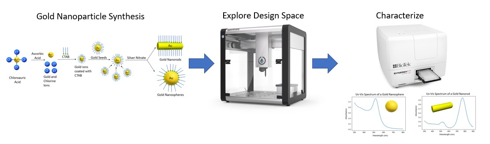
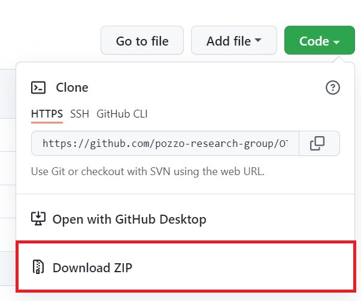
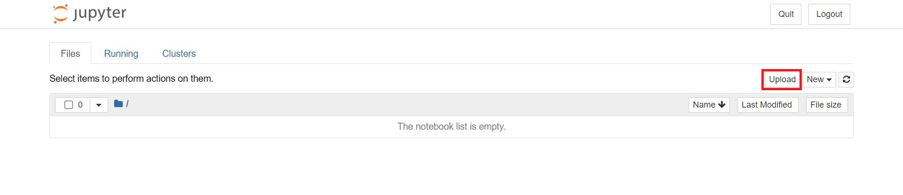
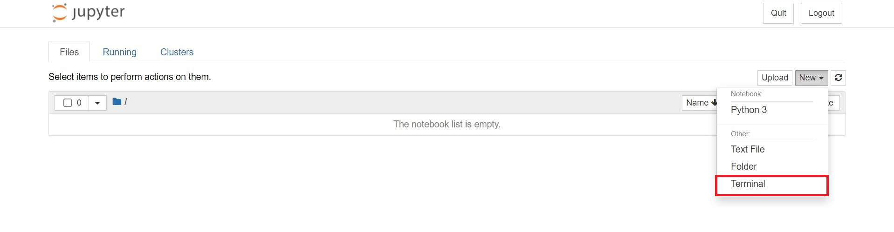

# OT2-Course-MSE
Course documents and code for introduction to high-throughput experimentation module for MSE

## Description 

<p align="center">

</p>

The purpose of this module is to introduce high-throughput experimentation for the synthesis of gold nanoparticles. Students will explore the design space used to create gold nanoparticles and then autonomously synthesize them using an OT2 liquid handling robot. Depending on the chosen regent concentrations, nanospheres or nanorods may form, which can sometimes be identified by the sample's color, or more accurately, by characterizing them using Uv-vis Spectroscopy. All the modules can be easily run using jupyter notebooks, without any coding experience.  


## Installation 

1. To install this library, first download the zip file from github.

<p align="center">

</p>

2. Open the jupyter notebook from the OT2 app.

<p align="center">

</p>

3. Upload the zip file to the OT2 jupyter notebook.

<p align="center">

</p>

4. Open the terminal.

<p align="center">
   
</p>

5. Run the following lines of code to unzip the file:
```
	cd var/lib/jupyter/notebooks 
	unzip OT2-Course-MSE-main
```